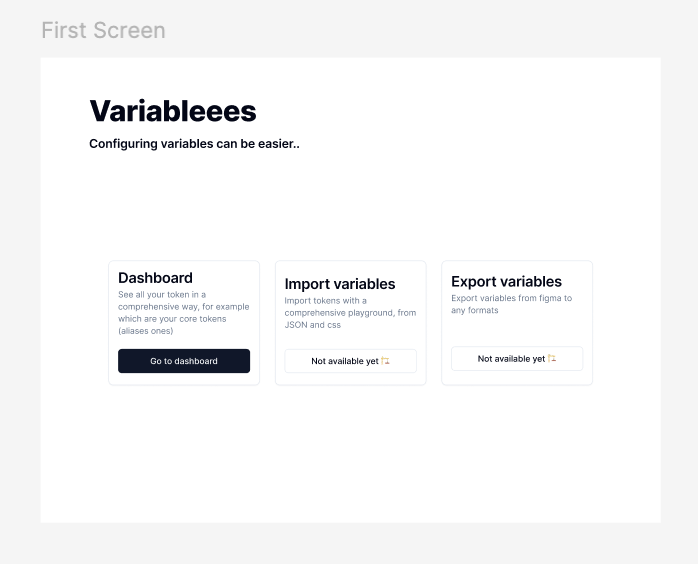

## Figma extension on tokens

I still find the ecosystem around the Figma variable a bit clunky, so I decided to create this extension to help me with that. This extension will probably only target my pain point and I'm very uncertain about reaching a release point.
However, I think I can learn from making such a project

### As of now
This extension is only a react app with shadcn and react-router (memory router) plugged in.

### Next steps

here is my first screen but I'm not sure what I will build, but here are my paint points.

- I didn't find any plugin that helped with quickly visualizing the free tokens, the token studio is nice but it's not free.
- I didn't find any plugin where you can give a CSS file, a JSON or a website and it proposes variable collections lists with visualizations before import.
- There were some nice export plugins but since the first two points were harder I thought I would add them.

